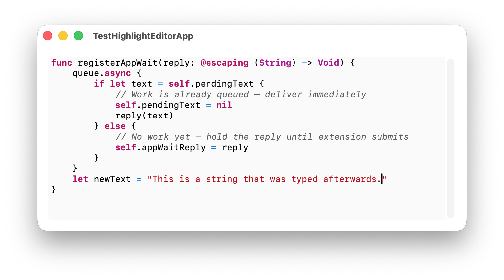

# HighlightedEditorView
HighlightedEditorView is a SwiftUI text editing view with real-time syntax highlighting, with support for 48 programming languages.

This project utilizes native code for highlighting. The speed of the syntax highlighting update on edit was measured around 50ms, while other highlighters that use JavaScript parsers might be a bit slower.


## Add HighlightedEditorView Package
You can add HighlightedEditorView as package to your Swift project. Open your project in Xcode, and from the menu bar, choose File, "Add Package Dependencies...". 

Enter:
`https://github.com/jsbakker/HighlightedEditorView`

in the Package URL / Search field. Select the version you want and the project you want to add it to, and click Add Package. It should automatically be linked against from the default target of the project.


## Using HighlightedEditor in SwiftUI
To use the syntax highlighted editor in your SwiftUI application, import `HighlightedEditorView`, and use `HighlightedEditor` in your content view.

```swift
import SwiftUI
import HighlightedEditorView

var sampleMultilineText = """
    func registerAppWait(reply: @escaping (String) -> Void) {
        queue.async {
            if let text = self.pendingText {
                // Work is already queued — deliver immediately
                self.pendingText = nil
                reply(text)
            } else {
                // No work yet — hold the reply until extension submits
                self.appWaitReply = reply
            }
        }
    }
    """

struct ContentView: View {
    var body: some View {

        HighlightedEditor(
        text: Binding(
            get: { sampleMultilineText },
            set: { sampleMultilineText = $0 }
        ), language: .swift)
            .frame(maxWidth: .infinity, alignment: .leading)
            .cornerRadius(8)
            .padding()
    }
}

#Preview {
    ContentView() // Yes, HighlightedEditor works in Previews
}
```


Note, how we can edit the contents at runtime, and the editor's new value will be updated by the binding's setter.

## Choose Supported Language
You may also displa a language picker with all of the supported languages.

```swift
@State private var language: WebCppLanguage = .swift

// later in view body ...

    Picker("Language", selection: $language) {
        ForEach(WebCppLanguage.allCases) { lang in
            Text(lang.displayName)
                .tag(lang)
        }
    }
```

## Credits
The syntax highlighting engine integrates code from [Web C Plus Plus (webcpp)](https://github.com/jsbakker/WebCPlusPlus), by Jeffrey Bakker. Webcpp development will be primarily done in HighlightedEditorView and backported to webcpp.
